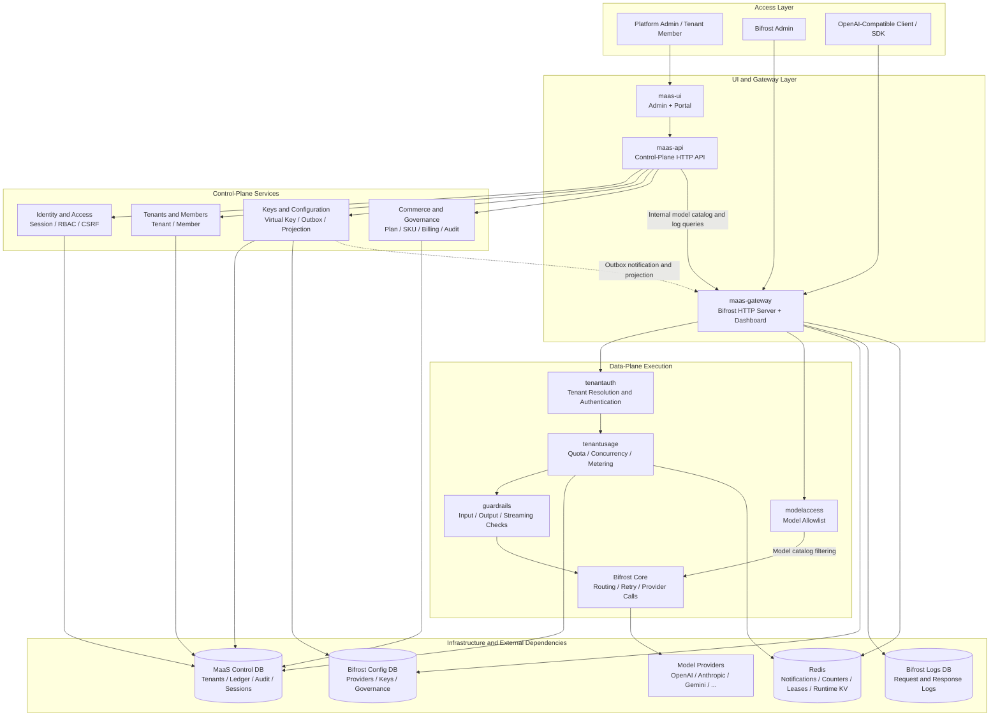

# MaaS: An Enterprise Multi-Tenant Platform Built on Bifrost

English | [Simplified Chinese](README.md)

MaaS (Model-as-a-Service) adds a multi-tenant control plane, tenant portal, Virtual Key management,
plans and metering, auditing, and cluster-wide runtime coordination on top of the
[Bifrost](https://github.com/maximhq/bifrost) data plane.

Control-plane and domain capabilities live in this repository. Bifrost is integrated through
plugins, wrappers, and a small set of general-purpose injection points. Local development uses Go
module `replace` directives to reference a sibling Bifrost workspace. The complete container image
also builds the Bifrost HTTP Server and Dashboard from that workspace.

## System Components

| Component | Responsibility |
|---|---|
| `maas-ui` | Platform administration console and tenant self-service portal |
| `maas-api` | Authentication, tenant, member, plan, Virtual Key, usage, and audit APIs |
| `maas-gateway` | Complete Bifrost data plane with MaaS authentication, metering, concurrency control, and guardrail plugins |
| Postgres | MaaS control database, Bifrost configuration database, Bifrost logs database, and persistent sessions |
| Redis | Configuration notifications, shared quota counters, concurrency leases, and Bifrost runtime KV |

## Layered Architecture



Solid lines represent synchronous requests or persistence calls. The dashed line represents
configuration changes projected to the data plane through the outbox, Redis notifications, and
generation reconciliation. The Gateway installs the Redis `RuntimeKVStore` during startup, so
Bifrost Core, routing, batch jobs, Gemini uploads, and realtime transports share the same
cross-node state.

## Core Capabilities

- Tenant isolation with Postgres RLS, startup preflight checks, and an explicit platform transaction mode.
- Separate trust boundaries for platform administrators and tenant members, with built-in
  `owner`, `admin`, `developer`, and `viewer` roles.
- Encrypted Virtual Key storage, lifecycle management, a transactional outbox, and idempotent
  projection into Bifrost.
- Plans, model allowlists, SKU pricing, shared USD quotas, Provider-attempt metering, and ledger linkage.
- Redis lease semaphores for tenant-level and Provider-level concurrency admission.
- A Redis-backed Bifrost `RuntimeKVStore` for session stickiness, cross-node coordination,
  one-time transport state, and registered decoder restoration.
- Append-only auditing, recursive sensitive-field redaction, and tenant-scoped request-log and usage details.
- Fail-closed guardrail hooks for input, output, and streaming chunks.

## UI Preview

### MaaS Administration Console

Tenant registry, lifecycle controls, and tenant resource entry points:

[](docs/image/admin_tenant.png)

Plans, shared quotas, model allowlists, and model cost pricing:

[](docs/image/admin_model_cost.png)

### MaaS Gateway

Provider, model, and upstream API key configuration:

[](docs/image/gateway_model.png)

### MaaS Tenant Portal

Tenant plan, shared quota, concurrency policy, and available models:

[](docs/image/portal_model_cost.png)

Tenant member and role management:

[](docs/image/portal_rbac.png)

Usage, token counts, cost, and request details:

[](docs/image/portal_cost.png)

## Repository Layout

```text
cmd/
  maas-api/             Control-plane HTTP service
  maas-gateway/         Bifrost HTTP Server with MaaS integration
internal/
  authn/                Postgres sessions and credential digests
  audit/                Append-only audit events
  billing/              SKUs, plans, metering, billing periods, and ledger
  bifrostprojection/    MaaS-to-Bifrost configuration projection
  configbus/            Generations, outbox, notifications, and reconciliation
  controlplane/         Tenant registry and lifecycle
  fairness/             Cluster-wide Redis concurrency leases
  httpapi/              Admin and Portal APIs
  member/               Tenant members and system roles
  migrate/              RLS, composite foreign key, and index migration primitives
  rediskv/              Bifrost Redis RuntimeKVStore
  requestlog/           Tenant-scoped request-log models
  rls/                  RLS startup checks
  tenant/               Tenant transaction binding and scoped store
  virtualkey/           Virtual Key source of truth and projection state machine
plugins/
  guardrails/           Content-policy hooks
  tenantauth/           Request authentication from Virtual Key to tenant
  tenantusage/          Quota, concurrency admission, and usage settlement
maas-ui/                Administration console and tenant portal frontend
deploy/bifrost/         Bifrost Postgres store configuration
deploy/postgres/        Database and runtime-role bootstrap
docs/                   Technical design and table-ownership audit
```

## Quick Start

### Prerequisites

- Go 1.27+
- Docker and Docker Compose
- Redis 6.2+. The runtime KV store uses atomic `GETDEL`; Compose uses Redis 7 by default.
- A sibling Bifrost source workspace

```text
workspaces/ai/gateway/
|-- bifrost/
`-- maas/
```

The local `go.mod` replacements and `Dockerfile.gateway` both use `../bifrost`. Building only
`maas-api` does not require the Bifrost source tree, but building the complete Gateway does.

### Start the Complete Stack

Create the deployment configuration and replace every credential:

```bash
cp .env.example .env
docker compose up -d --build
```

Inspect status and logs:

```bash
docker compose ps
docker compose logs -f maas-api maas-ui maas-gateway
```

| Entry Point | Default URL |
|---|---|
| Platform administration console | http://localhost:3000/admin |
| Tenant portal | http://localhost:3000/portal |
| MaaS API health check | http://localhost:18080/healthz |
| Bifrost Gateway and Dashboard | http://localhost:18081 |
| Gateway health check | http://localhost:18081/health |

Sign in to the platform administration console with `MAAS_ADMIN_USERNAME` and
`MAAS_ADMIN_PASSWORD` from `.env`. When opening the Bifrost Dashboard for the first time, use
`BIFROST_SETUP_TOKEN` under `Workspace -> Config -> Security` to create a separate Bifrost
administrator. The MaaS and Bifrost administrators belong to different security boundaries.

After configuring a Provider and model, call the OpenAI-compatible endpoint with a MaaS/Bifrost
Virtual Key:

```bash
curl http://localhost:18081/v1/chat/completions \
  -H 'Authorization: Bearer <virtual-key>' \
  -H 'Content-Type: application/json' \
  -d '{"model":"openai/gpt-4o-mini","messages":[{"role":"user","content":"ping"}]}'
```

### Builds on Restricted Networks

Override the module proxy only when the default Go module proxy is unavailable:

```bash
GOPROXY=https://goproxy.cn,direct GOSUMDB=off docker compose up -d --build
```

`GOSUMDB=off` disables checksum database verification and is suitable only for controlled
development networks. Production builds should keep verification enabled or use a trusted internal
module proxy.

## Configuration

[`.env.example`](.env.example) is the configuration entry point for Compose deployments. Review the
following variables before deployment.

### Credentials and Ports

| Variable | Purpose |
|---|---|
| `POSTGRES_PASSWORD` | MaaS control database administrator password |
| `BIFROST_CONFIG_PASSWORD` | Bifrost configuration database runtime-role password |
| `BIFROST_LOGS_PASSWORD` | Bifrost logs database runtime-role password |
| `BIFROST_ENCRYPTION_KEY` | Encryption key for sensitive Bifrost configuration |
| `BIFROST_SETUP_TOKEN` | Setup token used to create the first Bifrost administrator |
| `MAAS_ADMIN_USERNAME` / `MAAS_ADMIN_PASSWORD` | MaaS platform administrator credentials |
| `MAAS_KEY_ENCRYPTION_KEY` | AES-GCM master key for MaaS Virtual Keys; keep it stable and backed up |
| `MAAS_INTERNAL_TOKEN` | Authentication token for internal MaaS API-to-Gateway calls |
| `MAAS_BIND_HOST` | Host bind address; defaults to `127.0.0.1` |
| `MAAS_UI_PORT` / `MAAS_API_PORT` / `MAAS_GATEWAY_PORT` | Compose host ports |

### Gateway Policy

| Variable | Default | Purpose |
|---|---|---|
| `MAAS_CONFIG_RECONCILE_INTERVAL` | `15s` | Configuration generation reconciliation interval |
| `MAAS_USAGE_ENFORCEMENT` | `true` | Enables quota, concurrency admission, and usage settlement |
| `MAAS_CONCURRENCY_LEASE_TTL` | `5m` | Recovery period for abandoned concurrency leases |
| `MAAS_PROVIDER_MAX_CONCURRENT` | `0` | Global Provider concurrency limit; `0` means unlimited |
| `MAAS_BILLING_MARKUP_BPS` | `1000` | Platform-pool cost markup in basis points; `1000` means 10% |
| `MAAS_GUARDRAIL_BLOCKED_TERMS` | empty | Comma-separated baseline of locally blocked terms |

### Bifrost Runtime Redis KV

Compose reuses the internal `redis:6379` service by default. The Gateway process supports these
variables:

| Variable | Default | Purpose |
|---|---|---|
| `MAAS_KV_REDIS_ADDR` | `MAAS_REDIS_ADDR` | Redis address |
| `MAAS_KV_REDIS_PASSWORD` | `MAAS_REDIS_PASSWORD` | Redis password |
| `MAAS_KV_REDIS_USERNAME` | empty | Redis ACL username |
| `MAAS_KV_REDIS_DB` | `0` | Standalone Redis database; cluster mode requires `0` |
| `MAAS_KV_REDIS_USE_TLS` | `false` | Enables TLS |
| `MAAS_KV_REDIS_INSECURE_SKIP_VERIFY` | `false` | Skips TLS certificate verification; use only in controlled development environments |
| `MAAS_KV_REDIS_CA_CERT_PEM` | empty | Custom CA certificate in PEM format |
| `MAAS_KV_REDIS_CLUSTER_MODE` | `false` | Uses the Redis Cluster client |
| `MAAS_KV_REDIS_OP_TIMEOUT` | `2s` | Timeout for one KV operation |
| `MAAS_KV_REDIS_KEY_PREFIX` | `bifrost:kv:` | Key namespace prefix |

The default Compose file passes `ADDR`, `OP_TIMEOUT`, and `KEY_PREFIX`. When connecting to an
external Redis deployment with ACL or TLS, explicitly pass the corresponding variables through
`maas-gateway.environment` or configure them directly in the orchestration platform.

## API Overview

Except for login endpoints, business write endpoints require a valid session. Browser-session write
operations also require a valid CSRF token.

| Scope | Endpoints |
|---|---|
| Health | `GET /healthz`, `GET /api/health` |
| Platform session | `POST /api/auth/login`, `GET /api/auth/me`, `POST /api/auth/logout` |
| Tenant portal session | `POST /api/portal/auth/login`, `GET /api/portal/me`, `POST /api/portal/auth/logout` |
| Platform summary | `GET /api/admin/summary` |
| Tenant management | `/api/admin/tenants`, `/api/admin/tenants/{tenant}` |
| Platform member management | `/api/admin/tenants/{tenant}/members[/{member}]` |
| Platform Virtual Keys | `/api/admin/tenants/{tenant}/keys[/{key}[/retry]]` |
| Plans and pricing | `/api/admin/plans`, `/api/admin/skus`, `/api/admin/tenants/{tenant}/plan` |
| Model catalog and audit | `GET /api/admin/models`, `GET /api/admin/audit` |
| Portal members and keys | `/api/portal/members[/{member}]`, `/api/portal/keys[/{key}]`, `/api/portal/keys/{key}/retry`, `/api/portal/keys/{key}/reveal` |
| Portal plan and usage | `GET /api/portal/plan`, `GET /api/portal/usage`, `GET /api/portal/usage/{usage}/detail` |
| Portal request logs | `GET /api/portal/request-logs`, `GET /api/portal/request-logs/{request}` |
| Portal audit | `GET /api/portal/audit` |

The MaaS control database is the source of truth for Virtual Keys. Creation and revocation are
committed in the same transaction as their outbox events. The Gateway uses notifications and
generation reconciliation to project changes into the Bifrost ConfigStore and governance runtime
cache. List endpoints return only key fingerprints. Existing key plaintext can be revealed on demand
only by a tenant Owner with `key.reveal` permission, and every reveal is audited.

## Security and Runtime Semantics

- Bifrost `config_store` and `logs_store` must use Postgres. SQLite does not provide the RLS semantics
  required by this design.
- Startup preflight rejects runtime roles with `SUPERUSER` or `BYPASSRLS`, tables without
  `FORCE ROW LEVEL SECURITY`, and incomplete policy coverage.
- `deploy/bifrost/config.json` disables log materialized-view refresh. Postgres materialized views do
  not inherit base-table RLS and cannot be used as a tenant-isolated read path.
- Migration and runtime roles should be separate. Application credential compromise is outside the
  threat model that RLS can defend against.
- MaaS admission checks settled usage before a request and charges actual cost after the request. This
  provides bounded-overage semantics and must not be represented as a zero-overage prepaid hard quota.
- Redis is a Gateway runtime dependency. The Runtime KV constructor runs `PING`; connection failure
  prevents Gateway startup instead of silently degrading multi-node sessions and one-time state to
  process-local storage.
- Replace every development credential and example key before exposing any service.

## Local Development and Testing

Run the basic checks:

```bash
go build ./...
go vet ./...
go test ./...
```

RLS and Redis KV tests require real Postgres and Redis instances:

```bash
docker run -d --name maas-rls-spike \
  -e POSTGRES_PASSWORD=spike_password \
  -e POSTGRES_USER=spike \
  -e POSTGRES_DB=spike \
  -p 55432:5432 postgres:16-alpine

docker run -d --name maas-kv-redis \
  -p 56379:6379 redis:7-alpine
```

| Dependency | Default Test Address | Override Variables |
|---|---|---|
| Postgres | `localhost:55432` | `MAAS_SPIKE_PG_HOST`, `MAAS_SPIKE_PG_PORT`, `MAAS_SPIKE_PG_USER`, `MAAS_SPIKE_PG_PASSWORD`, `MAAS_SPIKE_PG_DB` |
| Redis | `localhost:56379` | `MAAS_KV_REDIS_ADDR` |

Run the Redis KV concurrency and race-safety checks:

```bash
go test -race ./internal/rediskv
```

Remove the disposable containers after testing:

```bash
docker rm -f maas-rls-spike maas-kv-redis
```

## Design Documents

- [MAAS_TECH_DESIGN.md](docs/MAAS_TECH_DESIGN.md): Architecture, module dependencies,
  implementation records, risk register, and decision log.
- [MAAS_TABLE_AUDIT.md](docs/MAAS_TABLE_AUDIT.md): Tenant-ownership classification and migration
  order for the 56 Bifrost tables.

Source comments reference technical-design section numbers. Keep those references synchronized when
restructuring the design documents.

## License

[Apache License 2.0](LICENSE). This project is built on Bifrost, which is also licensed under Apache 2.0.

Binary and Docker image distributions must include Bifrost's
[`LICENSE`](https://github.com/maximhq/bifrost/blob/main/LICENSE) and
[`THIRD_PARTY_NOTICES.md`](https://github.com/maximhq/bifrost/blob/main/THIRD_PARTY_NOTICES.md).
The image build includes the MaaS and Bifrost licenses and third-party notices in the resulting image.
