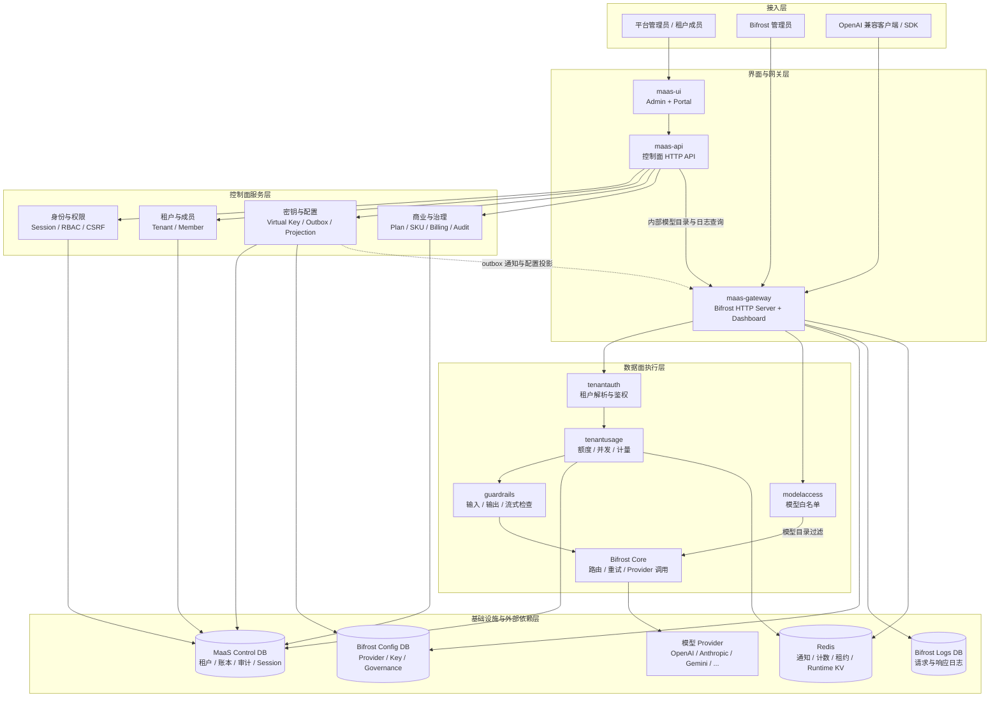
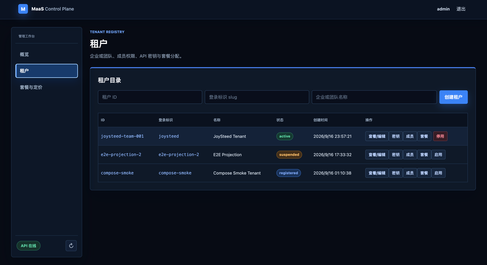
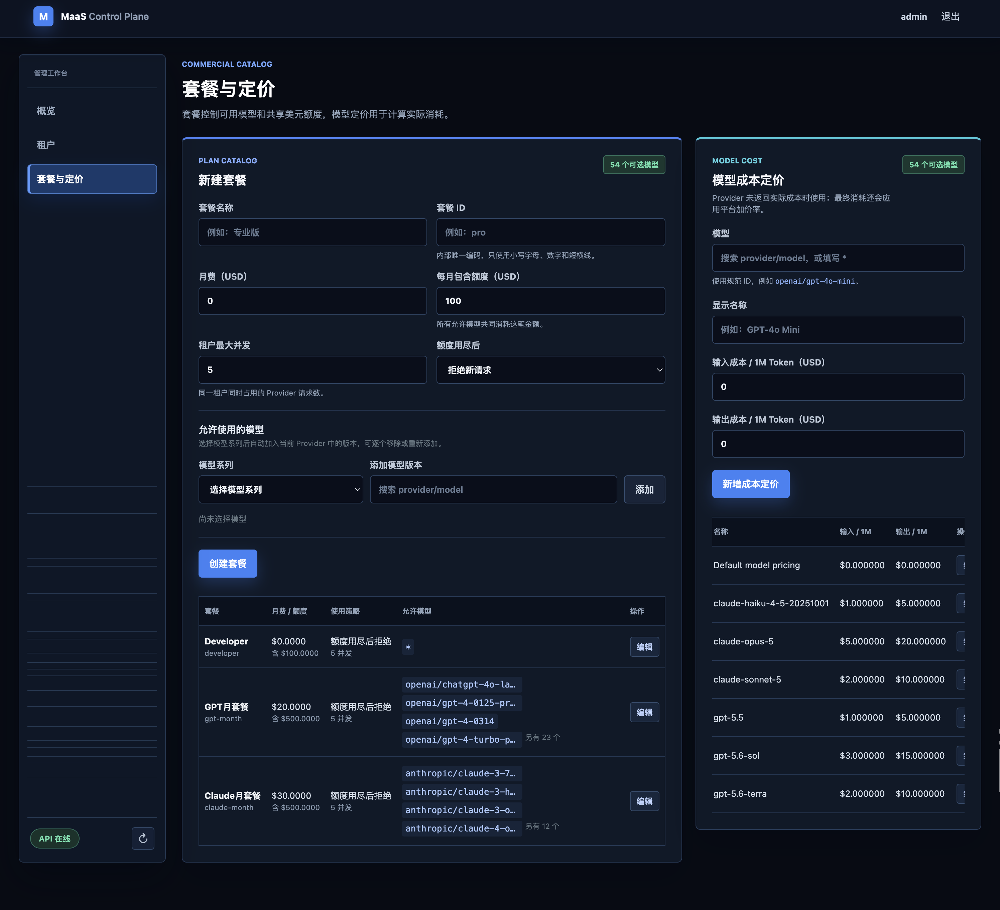
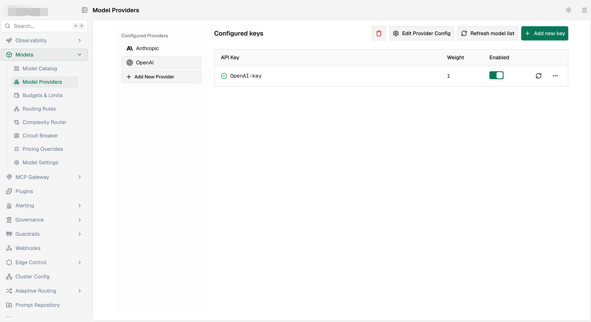
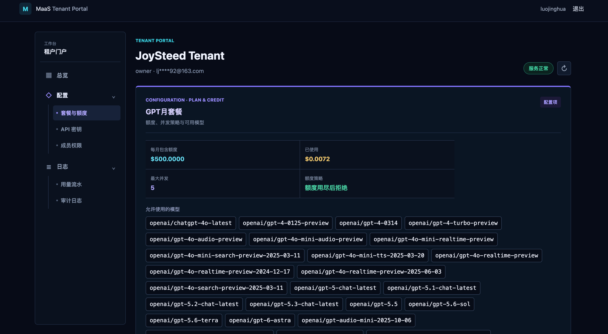
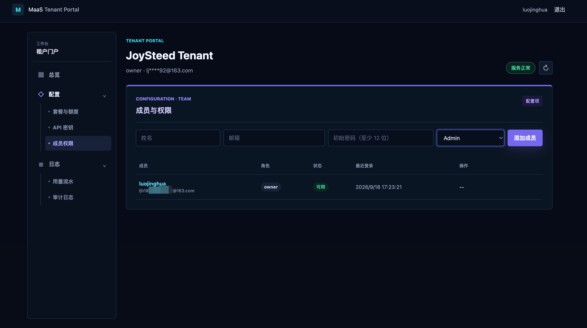
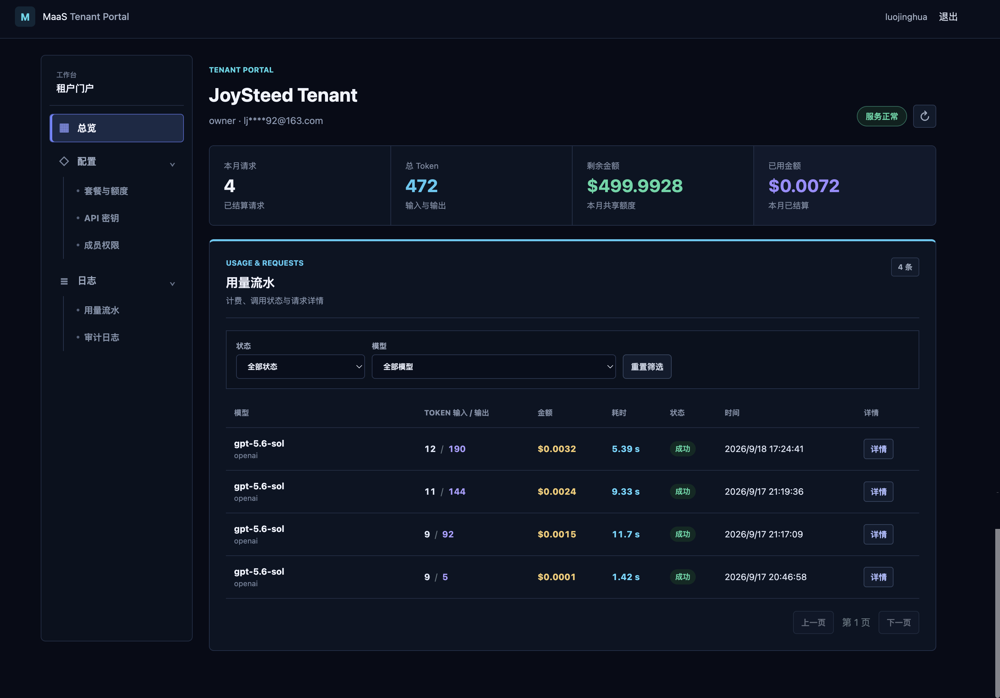

# MaaS：基于 Bifrost 的企业级多租户平台

[English](README.en.md) | 简体中文

MaaS（Model-as-a-Service）在 [Bifrost](https://github.com/maximhq/bifrost) 数据面之上提供
多租户控制面、租户门户、Virtual Key 管理、套餐与计量、审计以及集群级运行时协调。

控制面和领域能力保留在本仓库；Bifrost 通过 plugin、wrapper 和少量通用注入接口接入。
本地开发使用 Go module `replace` 引用同级的 Bifrost 工作区，完整镜像也从该工作区编译
Bifrost HTTP Server 与 Dashboard。

## 系统组成

| 组件 | 职责 |
|---|---|
| `maas-ui` | 平台管理后台与租户自服务门户 |
| `maas-api` | 登录、租户、成员、套餐、Virtual Key、用量和审计 API |
| `maas-gateway` | 完整 Bifrost 数据面，加载 MaaS 鉴权、计量、并发控制和 guardrail 插件 |
| Postgres | MaaS 控制库、Bifrost 配置库、Bifrost 日志库与持久化 session |
| Redis | 配置通知、共享额度计数、并发租约和 Bifrost 运行时 KV |

## 分层架构



实线表示同步请求或持久化调用，虚线表示配置变更通过 outbox、Redis 通知和 generation 对账
投影到数据面。Gateway 启动时安装 Redis `RuntimeKVStore`，因此 Bifrost Core、routing、batch、
Gemini upload 和 realtime transport 共享同一套跨节点状态。

## 核心能力

- Postgres RLS 租户隔离、启动前置检查和显式平台事务模式。
- 平台管理员与租户成员两套身份边界，租户内置
  `owner`、`admin`、`developer`、`viewer` 角色。
- Virtual Key 加密存储、生命周期管理、transactional outbox 和 Bifrost 幂等投影。
- 套餐、模型白名单、SKU 定价、共享 USD 额度、Provider attempt 计量和账本关联。
- Redis 租约 semaphore，实现租户与 Provider 两级并发准入。
- Redis 版 Bifrost `RuntimeKVStore`，覆盖会话粘性、跨节点协调、一次性 transport 状态和
  类型 decoder 恢复。
- 追加式审计、敏感字段递归脱敏、租户范围的请求日志与用量详情。
- 输入、输出和流式 chunk 的 fail-closed guardrail hook。

## 界面预览

### MaaS 管理后台

租户目录、生命周期与租户资源入口：

[](docs/image/admin_tenant.png)

套餐、共享额度、模型白名单与模型成本定价：

[](docs/image/admin_model_cost.png)

### MaaS Gateway

Provider、模型与上游 API Key 配置：

[](docs/image/gateway_model.png)

### MaaS 租户门户

租户套餐、共享额度、并发策略与可用模型：

[](docs/image/portal_model_cost.png)

租户成员与角色权限管理：

[](docs/image/portal_rbac.png)

用量、Token、费用和请求详情：

[](docs/image/portal_cost.png)

## 代码结构

```text
cmd/
  maas-api/             控制面 HTTP 服务
  maas-gateway/         集成 MaaS 的 Bifrost HTTP Server
internal/
  authn/                Postgres session 与凭据摘要
  audit/                追加式审计事件
  billing/              SKU、套餐、计量、账期与账本
  bifrostprojection/    MaaS 配置到 Bifrost 的投影
  configbus/            generation、outbox、通知与对账
  controlplane/         租户注册表与生命周期
  fairness/             Redis 集群级并发租约
  httpapi/              Admin 与 Portal API
  member/               租户成员与系统角色
  migrate/              RLS、复合外键和索引迁移原语
  rediskv/              Bifrost Redis RuntimeKVStore
  requestlog/           租户范围请求日志模型
  rls/                  RLS 启动检查
  tenant/               租户事务绑定与 scoped store
  virtualkey/           Virtual Key 真相源与投影状态机
plugins/
  guardrails/           内容策略 hook
  tenantauth/           Virtual Key 到租户的请求鉴权
  tenantusage/          额度、并发准入和用量结算
maas-ui/                管理后台与租户门户前端
deploy/bifrost/         Bifrost Postgres store 配置
deploy/postgres/        数据库与运行角色初始化
docs/                   技术设计与数据表归属审计
```

## 快速开始

### 前置条件

- Go 1.27+
- Docker 与 Docker Compose
- Redis 6.2+；Redis 运行时 KV 使用原子 `GETDEL`，Compose 默认使用 Redis 7
- 与本仓库同级的 Bifrost 源码工作区

```text
workspaces/ai/gateway/
├── bifrost/
└── maas/
```

`go.mod` 的本地 `replace` 和 `Dockerfile.gateway` 都使用 `../bifrost`。单独构建 `maas-api`
不需要 Bifrost 源码，完整 Gateway 构建需要该目录。

### 启动完整栈

创建部署配置，并替换其中的全部凭据：

```bash
cp .env.example .env
docker compose up -d --build
```

查看状态和日志：

```bash
docker compose ps
docker compose logs -f maas-api maas-ui maas-gateway
```

| 入口 | 默认地址 |
|---|---|
| 平台管理后台 | http://localhost:3000/admin |
| 租户门户 | http://localhost:3000/portal |
| MaaS API 健康检查 | http://localhost:18080/healthz |
| Bifrost Gateway 与 Dashboard | http://localhost:18081 |
| Gateway 健康检查 | http://localhost:18081/health |

平台管理员使用 `.env` 中的 `MAAS_ADMIN_USERNAME` 和 `MAAS_ADMIN_PASSWORD` 登录。
首次打开 Bifrost Dashboard 时，在 `Workspace -> Config -> Security` 使用
`BIFROST_SETUP_TOKEN` 创建独立的 Bifrost 管理员。两个管理员属于不同安全边界。

配置 Provider 和模型后，可使用 MaaS/Bifrost Virtual Key 调用 OpenAI 兼容端点：

```bash
curl http://localhost:18081/v1/chat/completions \
  -H 'Authorization: Bearer <virtual-key>' \
  -H 'Content-Type: application/json' \
  -d '{"model":"openai/gpt-4o-mini","messages":[{"role":"user","content":"ping"}]}'
```

### 受限网络构建

只有在默认 Go module proxy 不可用时才覆盖代理：

```bash
GOPROXY=https://goproxy.cn,direct GOSUMDB=off docker compose up -d --build
```

`GOSUMDB=off` 会关闭 checksum database 校验，只适合受控开发网络。生产构建应保留校验或使用
可信的内部模块代理。

## 配置

[`.env.example`](.env.example) 是 Compose 部署的配置入口。以下变量需要在部署前重点确认。

### 凭据与端口

| 变量 | 用途 |
|---|---|
| `POSTGRES_PASSWORD` | MaaS 控制库管理员密码 |
| `BIFROST_CONFIG_PASSWORD` | Bifrost 配置库运行角色密码 |
| `BIFROST_LOGS_PASSWORD` | Bifrost 日志库运行角色密码 |
| `BIFROST_ENCRYPTION_KEY` | Bifrost 持久化敏感配置加密密钥 |
| `BIFROST_SETUP_TOKEN` | 首次创建 Bifrost 管理员的 setup token |
| `MAAS_ADMIN_USERNAME` / `MAAS_ADMIN_PASSWORD` | MaaS 平台管理员凭据 |
| `MAAS_KEY_ENCRYPTION_KEY` | MaaS Virtual Key 的 AES-GCM 主密钥，必须固定并备份 |
| `MAAS_INTERNAL_TOKEN` | MaaS API 与 Gateway 内部接口鉴权令牌 |
| `MAAS_BIND_HOST` | 对外绑定地址，默认 `127.0.0.1` |
| `MAAS_UI_PORT` / `MAAS_API_PORT` / `MAAS_GATEWAY_PORT` | Compose 主机端口 |

### 网关策略

| 变量 | 默认值 | 用途 |
|---|---|---|
| `MAAS_CONFIG_RECONCILE_INTERVAL` | `15s` | 配置 generation 对账周期 |
| `MAAS_USAGE_ENFORCEMENT` | `true` | 启用额度、并发准入与用量结算 |
| `MAAS_CONCURRENCY_LEASE_TTL` | `5m` | 并发租约故障回收时间 |
| `MAAS_PROVIDER_MAX_CONCURRENT` | `0` | Provider 全局并发上限，`0` 表示不限制 |
| `MAAS_BILLING_MARKUP_BPS` | `1000` | 平台池成本加价基点，`1000` 表示 10% |
| `MAAS_GUARDRAIL_BLOCKED_TERMS` | 空 | 逗号分隔的本地阻断词基线 |

### Bifrost 运行时 Redis KV

Compose 默认复用内部 `redis:6379`。网关进程支持以下变量：

| 变量 | 默认值 | 用途 |
|---|---|---|
| `MAAS_KV_REDIS_ADDR` | `MAAS_REDIS_ADDR` | Redis 地址 |
| `MAAS_KV_REDIS_PASSWORD` | `MAAS_REDIS_PASSWORD` | Redis 密码 |
| `MAAS_KV_REDIS_USERNAME` | 空 | Redis ACL 用户名 |
| `MAAS_KV_REDIS_DB` | `0` | standalone DB；cluster 模式必须为 `0` |
| `MAAS_KV_REDIS_USE_TLS` | `false` | 启用 TLS |
| `MAAS_KV_REDIS_INSECURE_SKIP_VERIFY` | `false` | 跳过 TLS 证书校验，仅用于受控开发环境 |
| `MAAS_KV_REDIS_CA_CERT_PEM` | 空 | 自定义 CA PEM 内容 |
| `MAAS_KV_REDIS_CLUSTER_MODE` | `false` | 使用 Redis Cluster 客户端 |
| `MAAS_KV_REDIS_OP_TIMEOUT` | `2s` | 单次 KV 操作超时 |
| `MAAS_KV_REDIS_KEY_PREFIX` | `bifrost:kv:` | key 命名空间前缀 |

默认 Compose 传递 `ADDR`、`OP_TIMEOUT` 和 `KEY_PREFIX`。连接外部 Redis 并使用 ACL/TLS 时，
需要在 `maas-gateway.environment` 中显式传递对应变量，或在编排平台中直接配置网关环境。

## API 概览

除登录端点外，业务写接口都要求有效 session；基于浏览器 session 的写操作同时校验
CSRF token。

| 范围 | 端点 |
|---|---|
| 健康检查 | `GET /healthz`、`GET /api/health` |
| 平台会话 | `POST /api/auth/login`、`GET /api/auth/me`、`POST /api/auth/logout` |
| 租户门户会话 | `POST /api/portal/auth/login`、`GET /api/portal/me`、`POST /api/portal/auth/logout` |
| 平台概览 | `GET /api/admin/summary` |
| 租户管理 | `/api/admin/tenants`、`/api/admin/tenants/{tenant}` |
| 平台成员管理 | `/api/admin/tenants/{tenant}/members[/{member}]` |
| 平台 Virtual Key | `/api/admin/tenants/{tenant}/keys[/{key}[/retry]]` |
| 套餐与定价 | `/api/admin/plans`、`/api/admin/skus`、`/api/admin/tenants/{tenant}/plan` |
| 模型目录与审计 | `GET /api/admin/models`、`GET /api/admin/audit` |
| 门户成员与 Key | `/api/portal/members[/{member}]`、`/api/portal/keys[/{key}]`、`/api/portal/keys/{key}/retry`、`/api/portal/keys/{key}/reveal` |
| 门户套餐与用量 | `GET /api/portal/plan`、`GET /api/portal/usage`、`GET /api/portal/usage/{usage}/detail` |
| 门户请求日志 | `GET /api/portal/request-logs`、`GET /api/portal/request-logs/{request}` |
| 门户审计 | `GET /api/portal/audit` |

Virtual Key 以 MaaS 控制库为真相源。创建和撤销与 outbox 在同一事务提交，Gateway 通过通知和
generation 对账将变更投影到 Bifrost ConfigStore 与治理内存缓存。列表接口只返回密钥指纹；
已有密钥明文只能由具备 `key.reveal` 权限的租户 Owner 按需读取，并写入审计日志。

## 安全与运行语义

- Bifrost `config_store` 与 `logs_store` 必须使用 Postgres。SQLite 没有本方案依赖的 RLS 语义。
- 启动检查会拒绝 `SUPERUSER`、`BYPASSRLS`、未启用 `FORCE ROW LEVEL SECURITY` 或 policy
  覆盖不完整的运行角色和表。
- `deploy/bifrost/config.json` 将日志物化视图刷新设为 `off`。Postgres 物化视图不继承底表
  RLS，不能作为租户隔离读取路径。
- 数据迁移角色与运行角色应分离。应用凭据泄漏不属于 RLS 能防御的威胁模型。
- MaaS 额度准入采用“请求前按已结算金额检查、请求后按实际成本扣减”的有界超支语义，
  不应作为零超支的预付费硬额度对外承诺。
- Redis 是网关运行依赖。Runtime KV 构造时执行 `PING`，连接失败会阻止 Gateway 启动，避免
  多节点会话和一次性状态静默退化为进程内状态。
- 开发配置中的所有默认凭据和示例密钥都必须在暴露服务前替换。

## 本地开发与测试

基础检查：

```bash
go build ./...
go vet ./...
go test ./...
```

RLS 和 Redis KV 测试依赖真实的 Postgres 与 Redis：

```bash
docker run -d --name maas-rls-spike \
  -e POSTGRES_PASSWORD=spike_password \
  -e POSTGRES_USER=spike \
  -e POSTGRES_DB=spike \
  -p 55432:5432 postgres:16-alpine

docker run -d --name maas-kv-redis \
  -p 56379:6379 redis:7-alpine
```

| 依赖 | 默认测试地址 | 覆盖变量 |
|---|---|---|
| Postgres | `localhost:55432` | `MAAS_SPIKE_PG_HOST`、`MAAS_SPIKE_PG_PORT`、`MAAS_SPIKE_PG_USER`、`MAAS_SPIKE_PG_PASSWORD`、`MAAS_SPIKE_PG_DB` |
| Redis | `localhost:56379` | `MAAS_KV_REDIS_ADDR` |

Redis KV 并发安全验证：

```bash
go test -race ./internal/rediskv
```

测试结束后可删除一次性容器：

```bash
docker rm -f maas-rls-spike maas-kv-redis
```

## 设计文档

- [MAAS_TECH_DESIGN.md](docs/MAAS_TECH_DESIGN.md)：架构、模块依赖、实施记录、风险登记与决策日志。
- [MAAS_TABLE_AUDIT.md](docs/MAAS_TABLE_AUDIT.md)：Bifrost 56 张表的租户归属分类和迁移顺序。

源码注释会按章节号引用技术设计文档，调整文档结构时需要同步检查这些引用。

## 许可

[Apache License 2.0](LICENSE)。本项目基于同为 Apache License 2.0 的 Bifrost 构建。

分发二进制或 Docker 镜像时，需要同时携带 Bifrost 的
[`LICENSE`](https://github.com/maximhq/bifrost/blob/main/LICENSE) 和
[`THIRD_PARTY_NOTICES.md`](https://github.com/maximhq/bifrost/blob/main/THIRD_PARTY_NOTICES.md)。
镜像构建会将 MaaS 与 Bifrost 的许可和第三方通知一并放入产物。
